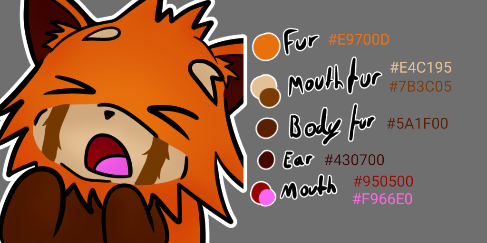

# Contribution Guide

## About

This documents information that should help you get started in contributing to the project, such as project conventions.

## License

This section is only relevant to submissions of new assets for the repository. If your contribution is feedback or an emote idea, this does not apply to you.

Before contributing, please keep in mind that this repository is under the [Creative Commons Attribution 4.0 International (CC BY 4.0)](https://creativecommons.org/licenses/by/4.0/legalcode) license.

**This is a permissive and perpetual license which grants anyone the right to use the work for any purpose, including commercial.**

Read the terms before submitting assets to the project. A [human readable summary of CC BY](https://creativecommons.org/licenses/by/4.0/) is also available.

## Conventions

### Files & Directories

| Directory | Purpose |
|---|---|
| `src/static/` | The full quality static emojis. |
| `src/masks/` | Grayscale mask that show what parts of the image can have it's color altered. |
| `src/projects/` | Project files for each emote. |
| `LICENSE` | The license your contribution will be published under. |
| `README.md` | Information and attributions to serve to anyone receiving the emotes. |

### Naming and Guidelines

| Type | Name | Notes |
|---|---|---|
| Emotes | pandaXyz.png | Minimum of 512x512, should still look good at 64x64. |
| Masks | pandaXyz.mask.png | Same size as emote. Not required if every pixel should be modulated for color variations. |
| Projects | pandaXyz.ora | You can use any program to draw, but the result must be an ORA file. |

### Reference Sheet

#### Color Palette

| Body Part | Colors |
|---|---|
| Fur | `#e9700d` |
| Mouth fur | `#e4c195`, `#7b3c05` |
| Body fur | `#5a1f00` |
| Ears | `#430700` |
| Mouth | `#950500`, `#f966e0` |

## Adding Emotes

There are three acceptable ways to include new emotes in the repository, in order of preference:

1. Fork the repository on GitLab, and use `git` to push your emote and open a merge request.
1. If you don't know how to open a merge request, you can open an [issue](https://gitlab.com/SethFalco/red-panda-emotes/issues) with your emote attached.
1. If you don't have a GitLab account and are reluctant to make one, email [Seth Falco](mailto:seth@falco.fun) and attach your emote.

If you follow either option 2 or 3, you must do the following in your message:

* Attach a copy of the [CC BY 4.0](https://creativecommons.org/licenses/by/4.0/) license, and declare that you understand the license terms.
* Share the name and email address you'd like to use for attribution.
