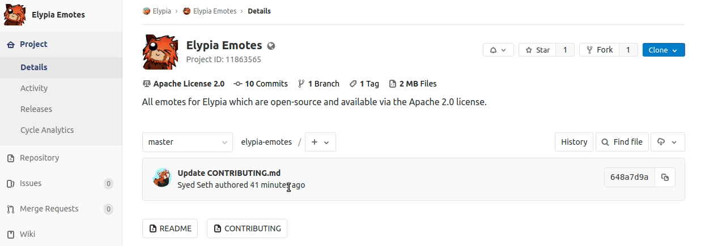
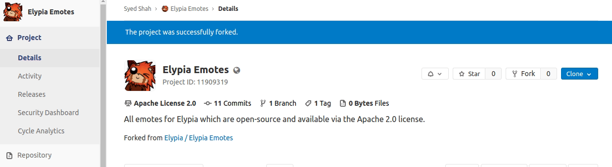

# Contribution Guide
## About
This will be a short document about any expectations, standards, or information you should know before you try to commit your own work, and how to contribute to this project if you're new to using git or GitLab.

There are two ways to contribute to this repository:  
1. Draw something and just create an [issue][issues] attaching your emote and asking us to asking for it to be added.
2. Using [`git`][git-scm] to pull the repository, add it yourself, push it back and make a merge request.

Using git is **strongly** recommended as it allows you to take credit and have your name/email listed in the [contributors][contributors] of the project, however if you're feeling lazy you can just attach your contribution as an issue and one of the maintainers will manually add it if they like it. 
> Feel free to join out [Discord][discord] and ask someone for help if you're not sure how to use git, we'll try explain below though!

<details>
    <summary><strong>Glossary</strong></summary>

Some of the terms used in this guide may not be friendly or obvious to people haven't used git before so here is a short key.

| Word | Definition | Synonyms |
|------|------------|----------|
| git  | Git is a version control system optimised for managing changes in files. | |
| clone | Downloading a copy of a project to either your own namespace or filesystem. | |
| fork | Cloning a project to your own namespace in order to make changes. | |
| branch | A single version of the repository. | version |
| master | The main version of the project, this is usually the most stable and up-to-date branch, others are _usually_ intended for development such as fixing an issue or adding a feature. | |
| merge | Pulling changes made from one branch into another branch. | |
| pull request | Requesting changes from your fork to be merged to a branch you don't have permission to merge to directly. | merge request |
| terminal | A console where you can execute commands, this refers to whatever your computer has for example: Command Prompt (cmd), PowerShell or Terminal). | |

</details>

### Issues

### Git
The git route involves typing commands into your terminal in order to interact with your repository both locally and on GitLab, in this guide we'll cover using CLI approach.

#### Requirements
* Have an account on GitLab.
* Install [git][git-scm].

#### Installing Git
If you need to download git you can just download it [here][git-scm], for most of the installation you can just use the default settings, this guide will not cover what the settings mean as they aren't relevent to this repository but you're welcome to look information up online via [Google][google] or [StackOverflow][stackoverflow].

You'll know you have git installed correctly once you are able to do the command `git --version` in terminal and get a non-error response such as:
```sh
$ git --version 
git version 2.17.1
```
> Prints the currently installed version of git, _if_ it's installed.

Remember you may need to restart your terminal instance after installation to make sure changes are in effect.

#### Configuring Credentials
Before we continue, we want to make sure when you commit to a git repository that it provides your name and email address, this is a nice thing to do in general, but especially helpful if you're hoping to actually have your name credited in the [contributors][contributors] section.

```sh
git config --global user.name "{NAME}"
git config --global user.email "{EMAIL}"
```
> This sets your name and email address for git, this should preferably be the same as your GitLab accounts name and email, but doesn't have to be, just replace the `{NAME}` and `{EMAIL}` with your name and email.  

**When performing commands with git make sure you're always executing them in your local repository!**

#### Forking the Project
The first step is to fork the project, this can be done via the GitLab website by just clicking the `Fork` button on the project home.


> Notice how at first we're in the project under the Elypia namespace (`Elypia > Elypia Emotes`) but after the fork we're now in another namespace (`{YOUR_NAMESPACE} > Elypia Emotes`).  
Forking the project will clone the project to your namespace so that you can track your own copy of the repository.

#### Cloning your Fork Locally
Now that you've made your fork you can clone it to the computer you wish to work from, you can get the clone URL from the top of **_your_** forked project.



It's simpler to use HTTPS if you're knew to git, but if you know what you're doing SSH is good.

```sh
git clone https://gitlab.com/{YOUR_NAME_SPACE}/elypia-emotes.git
```
> Download the repository so you can have a copy of everything in the project on your computer.

This command will download the repository locally into a `elypia-emotes` directory within wherever performed the command.

At this point you now have the repository cloned and you are welcome to make changes to the contents as you desire by either replacing or adding emotes.

#### Commiting Changes
Once you have made the changes you wish to make, for example a change to an existing emote, or adding your own new emote, you need to add, commit and push the changes.

```sh
git add .
```
> Tell git you want to add all changed files to be staged for commit.  

```sh
git commit -m "{COMMIT_MESSAGE}"
```
> Commit the changes to your local repository on your computer with the message you set, replace `{COMMIT_MESSAGE}` with a message that represents the changes in this commit.

```sh
git push origin/master
```
> Push the changes to your repository on GitLab so they are available in your fork of the elypia-emote repository.

You'll now find your changes on your project on GitLab!

#### Pull Request
Now that your changes are online and with GitLab, you'll able to make a pull request to the original branch under the Elypia namespace.

If you go to the elypia-emote repository under your namespace, you should see a message that you can do a pull request to the source branch (this refers to the original [Elypia/elypia-emote](https://gitlab.com/Elypia/elypia-
If you don't see a message like that, you can go to the `Merge Requests` tab and click `Create merge request` manually.

Make sure the merge request says:  
`From {YOUR_NAMESPACE}/elypia-emotes:{YOUR_BRANCH} into Elypia/elypia-emotes:master`

If it matches the above then you're trying to merge to the right place, if not scroll down a little and set the `Target branch` `Elypia/elypia-emotes` and `master`.

This is also a good place to get your pull request a title and description so we have more information on what you changed and why!

After this just click `Submit merge request`, and you'll see it [here](https://gitlab.com/Elypia/elypia-emotes/) for the repository maintainers to review.

### Finished!
You've just done your first pull request!  
In future you'll only have to do the steps starting from [`Commiting Changes`](#commiting-changes) so it should be much easier as time passes.

[contributors]: https://gitlab.com/Elypia/elypia-emotes/graphs/master "Contributors Graph"
[quick-start]: https://docs.gitlab.com/ee/gitlab-basics/start-using-git.html "Git Started"
[discord]: https://discord.gg/hprGMaM "Elypia on Discord"
[git-scm]: https://git-scm.com/ "Download Git"
[issues]: https://gitlab.com/Elypia/elypia-emotes/issues "Elypia Emotes Issue Board"
[google]: https://google.com/ "Google"
[stackoverflow]: https://stackoverflow.com/ "StackOverflow"
