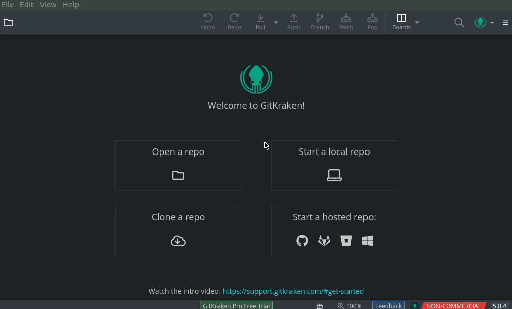
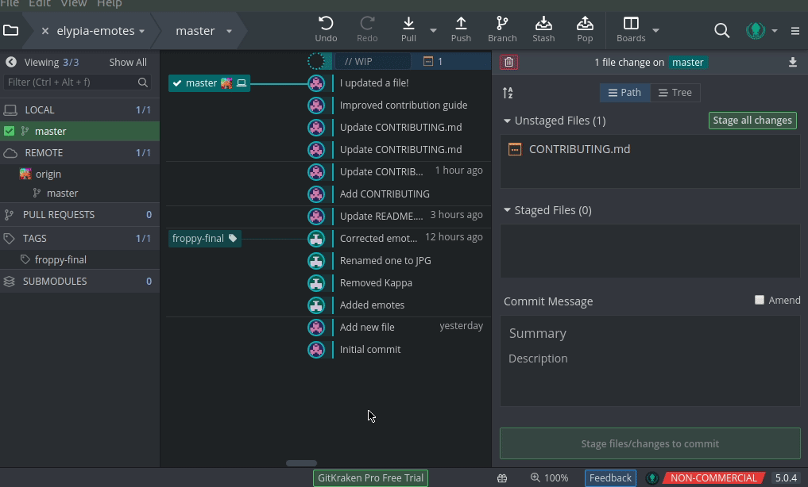

# Contribution Guide
<details>
    <summary><strong>Glossary</strong></summary>

Some of the terms used in this guide may not be friendly or obvious to people haven't used git before so here is a short key.

| Word | Definition | Synonyms |
|------|------------|----------|
| git  | Git is a version control system optimised for managing changes in files. | |
| clone | Downloading a copy of a project to either your own namespace or filesystem. | |
| fork | Cloning a project to your own namespace in order to make changes. | |
| branch | A single version of the repository. | version |
| master | The main version of the project, this is usually the most stable and up-to-date branch, others are _usually_ intended for development such as fixing an issue or adding a feature. | |
| merge | Pulling changes made from one branch into another branch. | |
| pull request | Requesting changes from your fork to be merged to a branch you don't have permission to merge to directly. | merge request |
| terminal | A console where you can execute commands, this refers to whatever your computer has for example: Command Prompt (cmd), PowerShell or Terminal). | |

</details>

## About
This will be a short document about any expectations, standards, or information you should know before you try to commit your own work, and how to contribute to this project if you're new to using git or GitLab.

There are two sets of instructions depending on how you want to contribute, both are perfectly viable options regardless of experience as they will achieve the same thing, in the same way.

### CLI (Command Line Interface)
The CLI route involves typing commands into your terminal in order to interact with your repository both locally and on GitLab, it's quite easy and quick to use once use to it but may require some confidence with command line.

### GUI (GitGraken)
The GUI route involves downloading a git client which will provide a window and buttons for cloning and commiting to projects, this is generally easier if you've never used git before or simply process information better visually, this guide will use GitKraken as the example as it's free for non-commercial projects such as this one and works on Windows, Mac, and Linux.

## Requirements
* In order to contribute you must have a GitLab account which you can make for free on this site.
* Either install:  
  * [git](https://git-scm.com/) if you want to take the CLI route.
  * A git client such as [GitKraken](https://www.gitkraken.com/invite?referralCode=bEXJc8LN) if you want to take the GUI route.

### Installing Git
If you need to download git you can just download it [here](https://git-scm.com/), for most of the installation you can just use the default settings, this guide will not cover what the settings mean as they aren't relevent to this repository but you're welcome to look information up online via [Google](https://www.google.com/) or [StackOverflow](https://stackoverflow.com/).

You'll know you have git installed correctly once you are able to do the command `git --version` in terminal and get a non-error response such as:
```sh
$ git --version 
git version 2.17.1
```
Remember you may need to restart your terminal instance after installation to make sure changes are in effect.

> When performing commands with git make sure you're always executing them in your local repository!

### Installing GitKraken
You can download it [here](https://www.gitkraken.com/invite?referralCode=bEXJc8LN), it's a simple installation, however you must have an account with GitHub or GitKraken in order to use it.

Once it's installed be sure to check your emails to activate your account if required.

#### GitLab Authentication
This will allow GitKraken to freely pull/push to your GitLab repositories without pestering for your credentials over and over.

1. Click the menu (3 bars) icon at the top right.
2. Navigate to: `Preferences > Authentication > GitLab.com`
3. Click `Connect to GitLab`.
4. Authenticate to your GitLab account.
5. `Generate SSH key and add to GitLab`

### Contributing
#### Forking the Project
The first step is to fork the project, this can be done via the GitLab website by just clicking the `Fork` button on the project home.


> Notice how at first we're in the project under the Elypia namespace (`Elypia > Elypia Emotes`) but after the fork we're now in another namespace (`{YOUR_NAMESPACE} > Elypia Emotes`).  
Forking the project will clone the project to your namespace so that you can track your own copy of the repository.

#### Cloning your Fork Locally
Now that you've made your fork you can clone it to the computer you wish to work from, you can get the clone URL from the top of **_your_** forked project and do it either through CLI or GUI.  


<details>
    <summary><strong>CLI</strong></summary>


It's simpler to use HTTPS but if you know what you're doing feel free to use SSH.  

```sh
git clone https://gitlab.com/{YOUR_NAME_SPACE}/elypia-emotes.git
```
With CLI this is all you have to do and you'll find a new directory in the location you did this command called `elypia-emotes` which contains the repository files.
</details>

<details>
    <summary><strong>GUI</strong></summary>

1. Navigate to: `Clone a repo > GitLab.com`
2. Specify any location to clone your repository.
3. Select the emote repository under your account.


</details>

At this point you now have the repository cloned and you are welcome to make changes to the contents as you desire by either replacing or adding emotes.

#### Commiting Changes
Once you have made the changes you wish to make, for example a change to an existing emote, or adding your own new emote, you need to add, commit and push the changes.

<details>
    <summary><strong>CLI</strong></summary>

```sh
git add .
```
> Tell git you want to add all changed files to be staged for commit.  

```sh
git commit -m "{COMMIT_MESSAGE}"
```
> Commit the changes to your local repository on your computer with the message you set, replace `{COMMIT_MESSAGE}` with a message that represents the changes in this commit.

```sh
git push origin/master
```
> Push the changes to your repository on GitLab so they are available in your fork of the elypia-emote repository.
</details>

<details>
    <summary><strong>GUI</strong></summary>

1. `Stage all changes`
2. Give the commit a title.
3. `Commit changes to X file(s)`
4. `Push`


</details>

You'll now find your changes on your project on GitLab!

#### Pull Request
Now that your changes are online and with GitLab, you'll able to make a pull request to the original branch under the Elypia namespace.

If you go to the elypia-emote repository under your namespace, you should see a message that you can do a pull request to the source branch (this refers to the original [Elypia/elypia-emote](https://gitlab.com/Elypia/elypia-emotes/) branch you cloned from.)  
If you don't see a message like that, you can go to the `Merge Requests` tab and click `Create merge request` manually.

Make sure the merge request says:  
`From {YOUR_NAMESPACE}/elypia-emotes:{YOUR_BRANCH} into Elypia/elypia-emotes:master`

If it matches the above then you're trying to merge to the right place, if not scroll down a little and set the `Target branch` `Elypia/elypia-emotes` and `master`.

This is also a good place to get your pull request a title and description so we have more information on what you changed and why!

After this just click `Submit merge request`, and you'll see it [here](https://gitlab.com/Elypia/elypia-emotes/) for the repository maintainers to review.
</details>

### Gratz!
You've just done your first pull request!  
In future you'll only have to do the steps starting from [`Commiting Changes`](#commiting-changes) so it should be much easier as time passes.