# Elypia Emotes
All emotes for Elypia which are open-source and available via the Apache 2.0 license.  
**For information on [contributing](CONTRIBUTE.md) please check out that file.**

## Emotes
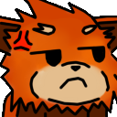  
  
  
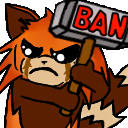  
  
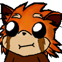  
  
  
  
  
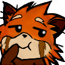  
  
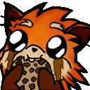  
  
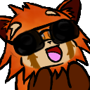  
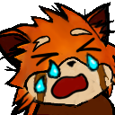  
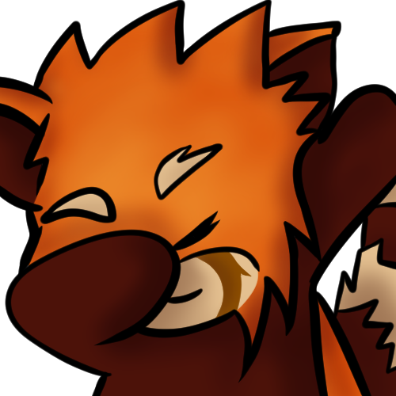  
  
  
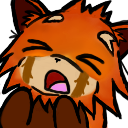  
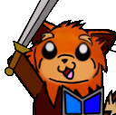  
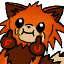  
  
  
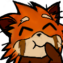  
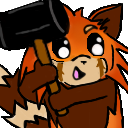  
  
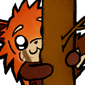  
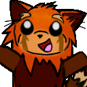  
  
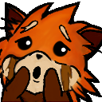  
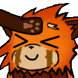  
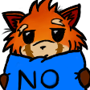  
  
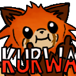  
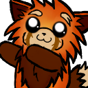  
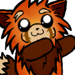  
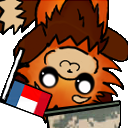  
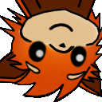  
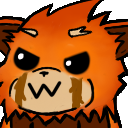  
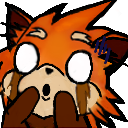  
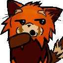  
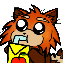  
  
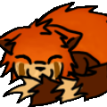  
  
  
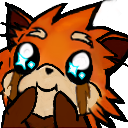  
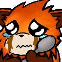  
  
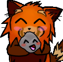  
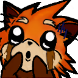  
  
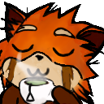  
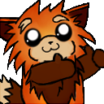  
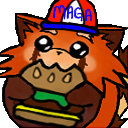  
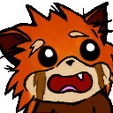  
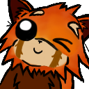  
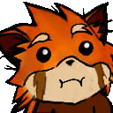  